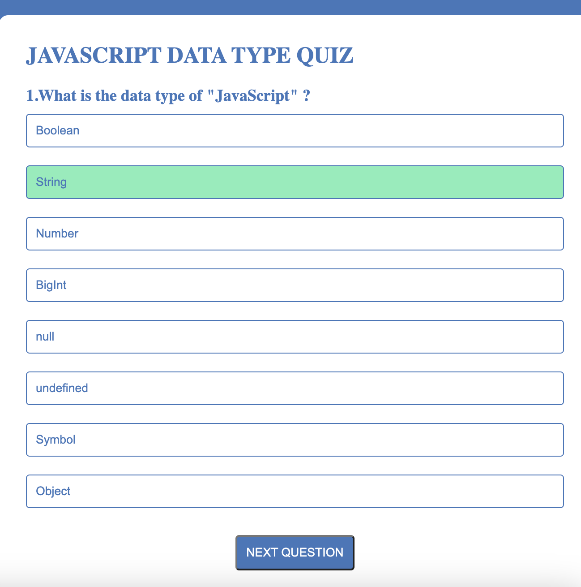
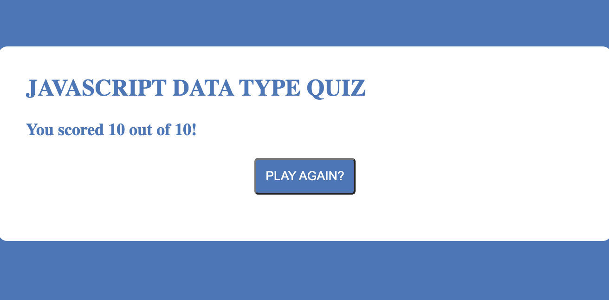

# **JavaScript Data Types Quiz** 

## **About JavaScript Data Types Quiz**

JavaScript Data Types quiz is a 10 question quiz game built to help beginning developers learn and differentiate the various eight data types in the JavaScript programming language.

## **Personal Note**

JavaScript was the first programming language that I ever learned during General Assembly's Software Engineering Immersive bootcamp.

I originally built this JavaScript quiz to help myself learn the various eight datatypes in JavaScript, but I soon realized it could help others, too.

## **Screenshots**:

## **Technologies Used** 

**JavaScript, HTML, CSS, Express.JS**

## **Getting Started**: 

Launch the JavaScript Datay Types Quiz here: https://jasonjjiang.github.io/javascript-datatype-quiz/.

You can begin the quiz by simply selecting your answer to the first question of the quiz.

If you answer correctly, your answer will be highlighted in green. If it is an incorrect answer, your answer will be highlighted in red.

Regardless of whether you select the correct answer, you will see the correct answer highlighted in green. 

After your answer has been selected, just press the "NEXT QUESTION" button to proceed to the next question. 

Your final score will appear out of 10 once you have completed the quiz. You can replay the quiz by pressing the "PLAY AGAIN?" button.

## **Ice Box Features**:

- I would like to implement more data type questions in the question base with a randomized function so players can answer a wider variety of questions while receiving a different order and type of questions each run through.

- I would like to create a home page different than where the quiz is played.

- On the home page, I would like to implement an all-time high scores board where users can see who scored the top 5 highest scores. I would give players an option to input their name along with their score at the end of each quiz attempt.

